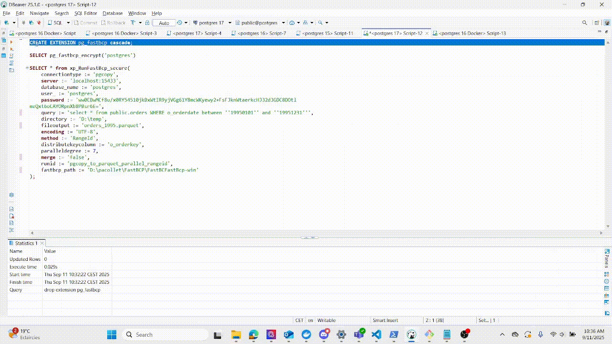

# pg_fastbcp
A PostgreSQL extension to run the [FastBCP](https://www.arpe.io/fastbcp/?v=82a9e4d26595) tool from an SQL function, enabling fast extract from databases.



## Table of Contents
- [Prerequisites](#prerequisites)
- [FastBCP Tool Requirement](#fastbcp-tool-requirement)
- [Installation](#installation)
  - [Windows](#windows)
  - [Linux](#linux)
- [SQL Setup](#sql-setup)
- [Function: pg_fastbcp_encrypt](#function-pg_fastbcp_encrypt)
- [Function: xp_RunFastBcp_secure Usage](#function-xp_runfastbcp_secure-usage)
- [Function Return Structure](#function-return-structure)
- [Notes](#notes)


## Prerequisites
- Administrator privileges on Windows to copy files to the PostgreSQL installation directory.  
- Your **FastBCP tool binaries**. This extension requires the tool to be installed separately.


## FastBCP Tool Requirement
This extension requires the **FastBCP tool** to be installed separately.

Download FastBCP and get a free trial license here:  
👉 [https://www.arpe.io/get-your-fastbcp-trial](https://www.arpe.io/get-your-fastbcp-trial)

Once downloaded, extract the archive and provide the folder path using the `fastbcp_path` parameter when calling the `xp_RunFastBcp_secure` SQL function.

⚠️ **Important:** The PostgreSQL server process usually runs under the `postgres` user account.  
You must ensure that this user has the appropriate permissions to execute the `FastBCP` binary and read the license file.

---

### On Linux
- The `FastBCP` binary must be **executable by the `postgres` user**.  
- The license file (`.lic`) must be **readable by the `postgres` user**.  
- Example:  
```bash
# Grant execute permission on the FastBCP binary
sudo chmod +x /path/to/FastBCP

# Ensure the postgres user can access it
sudo chown postgres:postgres /path/to/FastBCP
sudo chmod 750 /path/to/FastBCP

# Grant read permission on the license file
sudo chown postgres:postgres /path/to/license.lic
sudo chmod 640 /path/to/license.lic
```

---

### On Windows

Make sure that the PostgreSQL service account (by default `NT AUTHORITY\NetworkService` or `postgres` if you installed it manually) has:

* **Execute permission** on the `FastBCP.exe` binary
* **Read permission** on the `.lic` file


## Installation
This section covers how to install the **pg_fastbcp** extension.


### Windows

#### Automated Installation
The easiest way to install the extension is by using the `install-win.bat` script included in the archive.

1. Extract the contents of the ZIP file into a folder. This folder should contain the following files:  
   - `pg_fastbcp.dll`  
   - `pg_fastbcp.control`  
   - `pg_fastbcp--1.0.sql`  
   - `install-win.bat`  

2. Right-click on the `install-win.bat` file and select **"Run as administrator"**.  
3. The script will automatically detect your PostgreSQL installation and copy the files to the correct locations.

#### Manual Installation
If the automated script fails or you prefer to install the files manually, follow these steps:

1. Stop your PostgreSQL service. (**Critical step** to ensure files are not in use).  
2. Locate your PostgreSQL installation folder, typically found at:  
```
C:\Program Files\PostgreSQL\<version>
```
3. Copy the `pg_fastbcp.dll` file into the `lib` folder of your PostgreSQL installation.  
4. Copy the `pg_fastbcp.control` and `pg_fastbcp--1.0.sql` files into the `share\extension` folder.  
5. Restart your PostgreSQL service.  

---

### Linux

#### Automated Installation
The easiest way to install the extension on Linux is by using the `install-linux.sh` script included in the archive.

1. Extract the contents of the archive into a folder. This folder should contain:  
   - `pg_fastbcp.so`  
   - `pg_fastbcp.control`  
   - `pg_fastbcp--1.0.sql`  
   - `install-linux.sh`  

2. Make the script executable:  
```bash
chmod +x install-linux.sh
````

3. Run the script with administrator privileges:

```bash
sudo ./install-linux.sh
```

The script will automatically detect your PostgreSQL installation and copy the files to the correct locations.

#### Manual Installation

If the automated script fails or you prefer to install the files manually, follow these steps:

1. Stop your PostgreSQL service (important to ensure files are not in use):

```bash
sudo systemctl stop postgresql
```

2. Locate your PostgreSQL installation directory, typically:

```
/usr/lib/postgresql/<version>
```

3. Copy the files into the appropriate directories:

* `pg_fastbcp.so` → PostgreSQL `lib` directory
* `pg_fastbcp.control` and `pg_fastbcp--1.0.sql` → PostgreSQL `share/extension` directory

Example:

```bash
sudo cp pg_fastbcp.so /usr/lib/postgresql/<version>/lib/
sudo cp pg_fastbcp.control pg_fastbcp--1.0.sql /usr/share/postgresql/<version>/extension/
```

4. Restart your PostgreSQL service:

```bash
sudo systemctl start postgresql
```


## SQL Setup
After the files are in place, you need to set up the extension in your database.

### Drop existing extension (if any)
If you are updating the extension, drop the existing one first:

```sql
DROP EXTENSION IF EXISTS pg_fastbcp CASCADE;
````

### Create the extension

```sql
CREATE EXTENSION pg_fastbcp CASCADE;
```


## Function: pg\_fasttransfer\_encrypt

This function encrypts a given text string using `pgp_sym_encrypt` and encodes the result in base64.
It is useful for storing sensitive information, such as passwords, in a secure manner within your SQL scripts or configuration.

The `xp_RunFastTransfer_secure` function will automatically decrypt any values passed to its `--sourcepassword` and `--targetpassword` arguments using the same encryption key.
**The encryption/decryption key is defined by the `PGFT_ENCRYPTION_KEY` variable in the C source file (`pg_fasttransfer.c`)**

### Syntax

```sql
pg_fastbcp_encrypt(text_to_encrypt text) RETURNS text
```

### Example

```sql
SELECT pg_fastbcp_encrypt('MySecurePassword');
-- Returns: A base64-encoded encrypted string, e.g., "PgP...base64encodedstring=="
```


## Function: xp\_RunFastBcp\_secure Usage

This is the main function to execute the FastBCP tool.
It takes various parameters to configure the data extraction operation.

Password argument (`password`) will be automatically decrypted 

**Syntax:**

```sql
xp_RunFastBcp_secure(
    connectiontype text DEFAULT NULL,
    connectionstring text DEFAULT NULL,
    dsn text DEFAULT NULL,
    provider text DEFAULT NULL,
    server text DEFAULT NULL,
    user_ text DEFAULT NULL,
    password text DEFAULT NULL,
    trusted boolean DEFAULT NULL,
    database_name text DEFAULT NULL,
    decimalseparator text DEFAULT NULL,
    fileinput text DEFAULT NULL,
    query text DEFAULT NULL,
    sourceschema text DEFAULT NULL,
    sourcetable text DEFAULT NULL,
    fileoutput text DEFAULT NULL,
    directory text DEFAULT NULL,
    delimiter text DEFAULT NULL,
    quotes boolean DEFAULT NULL,
    dateformat text DEFAULT NULL,
    encoding text DEFAULT NULL,
    paralleldegree integer DEFAULT NULL,
    method text DEFAULT NULL,
    distributekeycolumn text DEFAULT NULL,
    merge boolean DEFAULT NULL,
    timestamped boolean DEFAULT NULL,
    noheader boolean DEFAULT NULL,
    boolformat text DEFAULT NULL,
    runid text DEFAULT NULL,
    settingsfile text DEFAULT NULL,
    cloudprofile text DEFAULT NULL,
    license text DEFAULT NULL,
    fastbcp_path text DEFAULT NULL
) RETURNS TABLE
```

---

### Example

This example demonstrates an extract from an Postgres source to parquet :

```sql
SELECT * FROM xp_RunFastBcp_secure(
    connectiontype := 'pgcopy',
    server := 'localhost:15433',
    database_name := 'postgres',
    user_ := 'postgres',
    password := 'ww0EBwMCf8u/x0RY54510jkBxWtIR9yjVGg61Y8mcWKyewy2+FsFJknWtaerkcHJ32d3GDC8DOtl
meQxt6oCAYORpnXb8PBsr6E=',
    query := 'select * from public.orders WHERE o_orderdate between ''19950101'' and ''19951231''',
    directory := 'D:\tmp',
    fileoutput := 'orders_1995.parquet',
    encoding := 'UTF-8',
    method := 'RangeId',
    distributekeycolumn := 'o_orderkey',
    paralleldegree := 7,
    merge := 'true',
    runid := 'pgcopy_to_parquet_parallel_rangeid',
    fastbcp_path := 'D:\FastBCP-Folder'
);
```


## Function Return Structure

The function returns a table with the following columns, providing details about the execution:

| Column          | Type    | Description                                |
| --------------- | ------- | ------------------------------------------ |
| exit\_code      | integer | The exit code of the FastBCP process.      |
| output          | text    | The full log output from the FastBCP tool. |
| total\_rows     | bigint  | The total number of rows transferred.      |
| total\_columns  | integer | The total number of columns transferred.   |
| total\_time | bigint  | The total execution time in milliseconds.  |


## Notes

* The extension uses `pg_config` to locate PostgreSQL paths, so ensure it is available in your **PATH** if you are running the script.  
* You must have sufficient permissions to copy files into the PostgreSQL installation directories.  
* On Linux, when directories or files are created directly by the `postgres` user (e.g., during execution of FastBCP or PostgreSQL processes), they will belong to that account.  
  - In such cases, you may not have permission to view or access these files with your own user account.  
  - To inspect them, you will need to either switch to the `postgres` user:  
    ```bash
    sudo -i -u postgres
    ```
    or adjust permissions if appropriate (be careful to avoid weakening security).  


